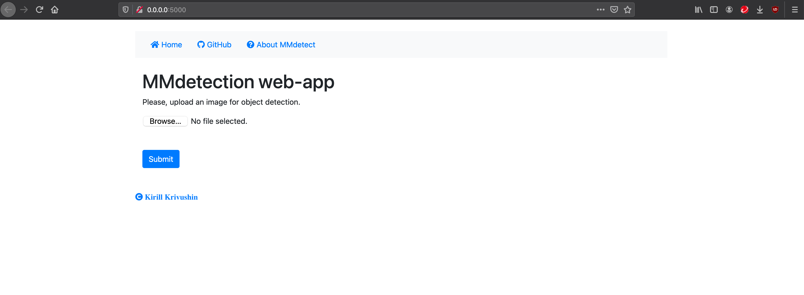
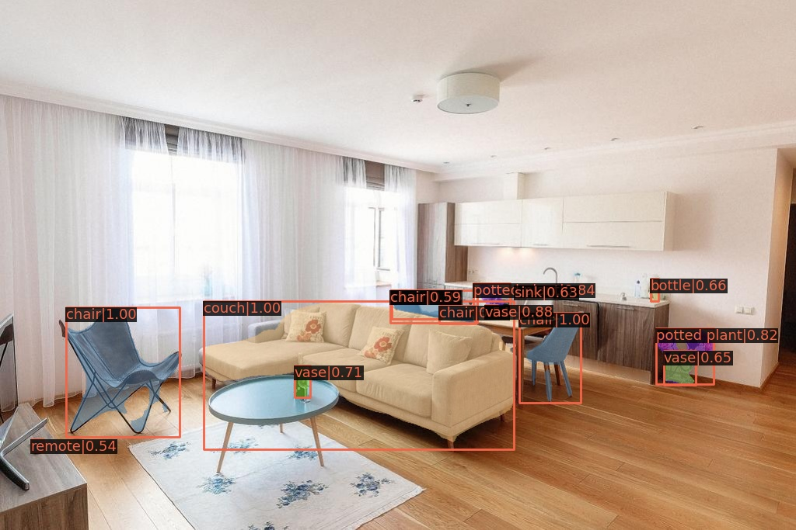
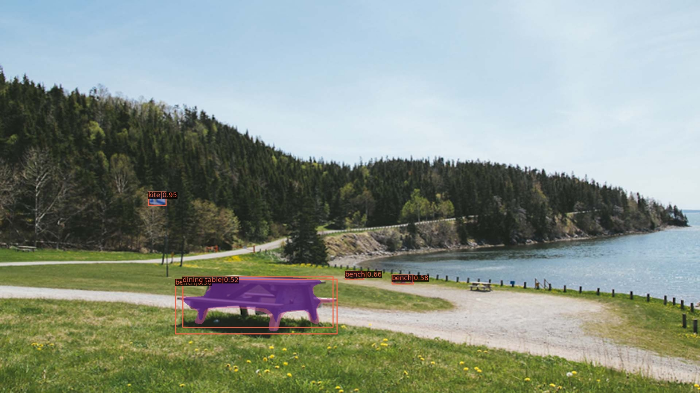
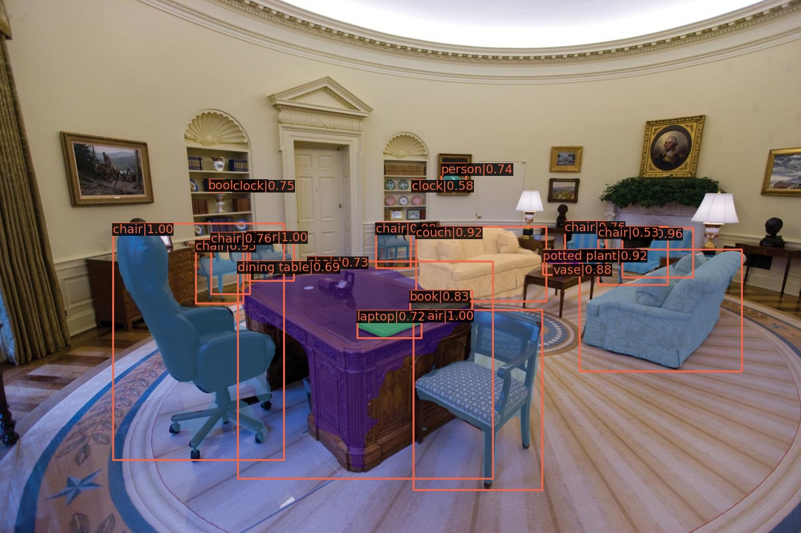
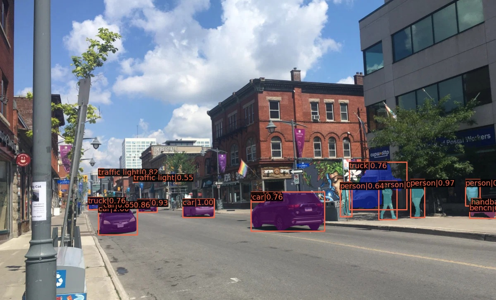
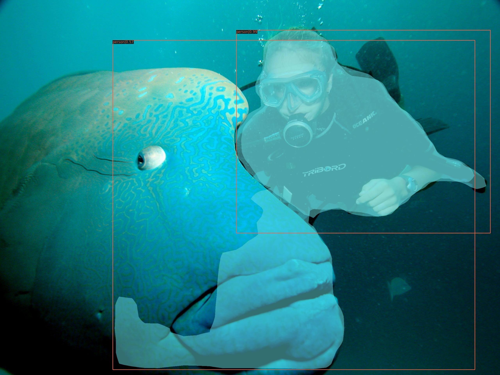
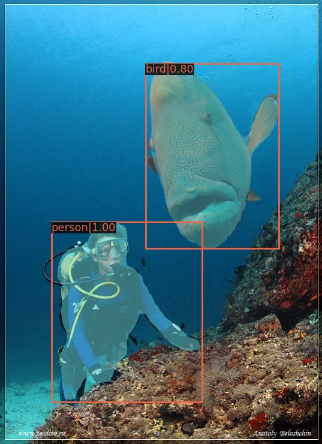
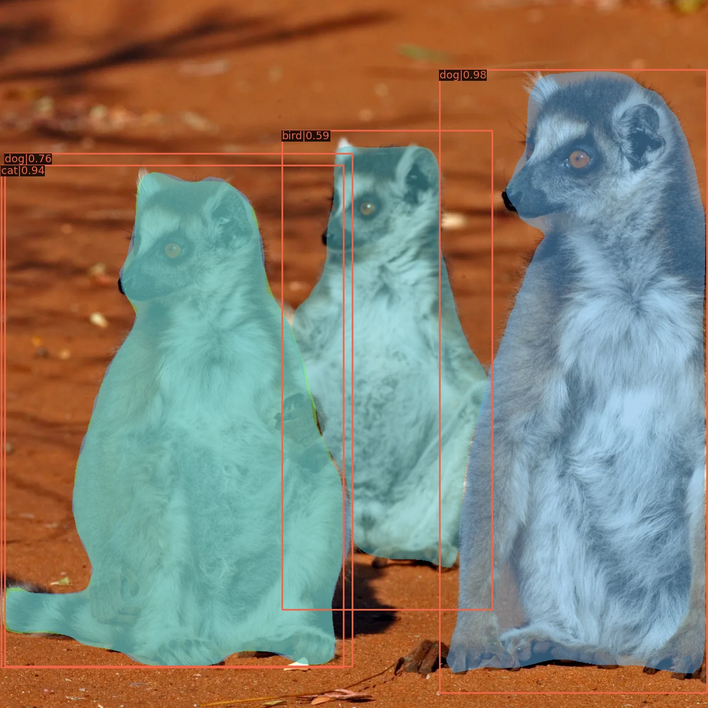

# Project description
This is a capstone project for advanced track of the Deep Learning School (Fall-2020).  
`Flask-detector` is a web application for object detection consisting of following components
- Flask
- Redis server
- RQ (Redis Queue)
- Pretrained `Mask-RCNN-R50`

A user uploads a picture and gets back a detected image. The result can be downloaded.

## Deploymnet

  - Clone the repository with `git clone https://github.com/biomlds/flask_detector` and `cd flask_detector/`
  
  
- ### Docker on a local computer

  1. Install [Docker](https://www.docker.com/products/docker-desktop)
  2. `docker build --rm -t flask-detector .`
  3. `docker run -p 5000:5000   -it flask-detector`
  4. Open [https://0.0.0.0:5000](https://0.0.0.0:5000)

- ### Heroku

    1. `heroku create -a flask-detector`
    2. `heroku container:push web`
    3. Set a secret key: `heroku config:set SECRET_KEY=Your_Secret_Key`
    4. `heroku container:push web`
    5. `heroku container:release web`
    6. `heroku open` or open [https://flask-detector.herokuapp.com](https://flask-detector.herokuapp.com)

__NOTE:__ 
  - As a proove of concept, the app was deployed on a free `heroku` dyno: [https://flask-detector.herokuapp.com](https://flask-detector.herokuapp.com). 
  - Due to 500 Mb RAM limit of the virtual machine it tends to crash quite often. For stable work either use the docker container or deploy on a server with 1Gb of RAM.
  - `flask-detector` was tested in a local docker container.

## MMDetection
[MMDetection](https://github.com/open-mmlab/mmdetection) is an open-source object detection toolbox based on PyTorch. It comes with a zoo of model pretrained on the [COCO dataset]("https://cocodataset.org/#home"). This dataset includes 80 categories captured from everyday scenes. The full list of labels is available [here]('https://github.com/amikelive/coco-labels/blob/master/coco-labels-2014_2017.txt'). 

## Object detection results
This App make use of pretrained `Mask R-CNN R-50 FPN` model pretrained on the COCO dataset. As a result there is no big surprise it performs well on pictures taken in a daily settings, while poorly in less common scenes like a zoo or diving. 

Following pictures contained objects from the COCO dataset and were successfully identified:
- apartment 
- park 
- oval office 
- street 

While the model is able to recognize the diver, it fails to detect the fish (e.g. diving1) or even misidentify it as a bird (diving2):
- diving1
- diving2 

Sometimes the net produces conflicting result for the same class of objects it never saw a lemur, but it was trained on cats, dogs and birds:

Refered test and processed images are in the `test_mages` subfolder.

All in all, it is clear that fine tuning is required to adapt the model to a specific domain. For example, to improve performance of the neural net on above mentioned pictures, it could be trained on a dataset of animals.