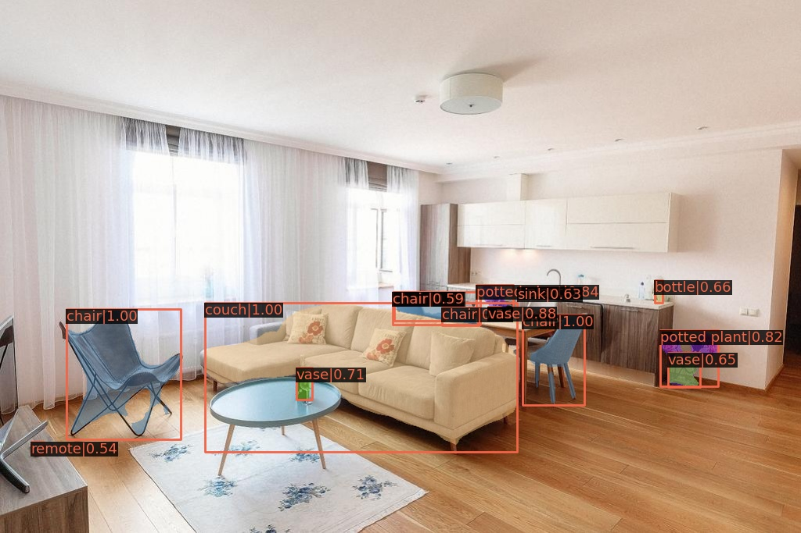

## Project description
This is a copstone project for advanced track of the Deep Learning School (Fall-2020).
It is a web applocation 

# MM-detect
MMDetection is an open source object detection toolbox based on PyTorch. It comes with a zoo of model prertrained on the [COCO dataset]("https://cocodataset.org/#home").

# Deploymnet om Heroku

heroku container:push web 
heroku container:release web
heroku open

heroku destroy --confirm flask-detector